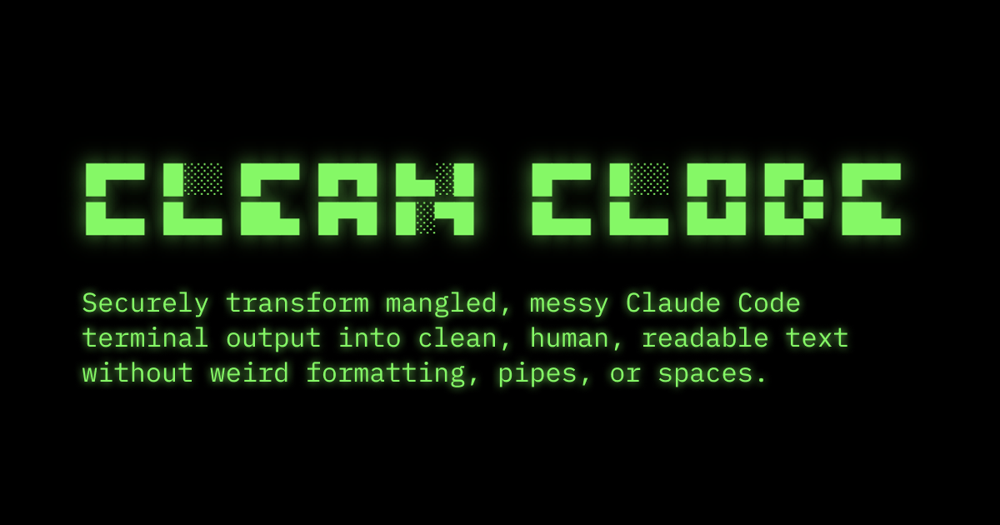

[](https://cleanclode.com)

# Clean Clode

🌐 Try it now at **[cleanclode.com](https://cleanclode.com)**

[](https://www.gnu.org/licenses/gpl-3.0)

Clean Clode (CleanClode) simple web utility that cleans up messy terminal text from Claude Code and OpenAI Codex. Transform cluttered terminal output into clean, readable text ("Clean C(l)ode").


## ✨ What it does

- **Smart detection** - Automatically chooses the right cleaning method for different text types
- **Claude Code dumps** - Removes pipes, box characters, and formatting artifacts
- **Broken text** - Fixes line wrapping while preserving lists and structure
- **Privacy first** - Everything runs in your browser, no data sent anywhere
- **One-click copy** - Auto-copies cleaned text to clipboard


## 🚀 Usage

**Online**: Visit [cleanclode.com](https://cleanclode.com)

**Local**: Clone and open `index.html` in your browser


## 📋 Example

**Before:**
```
│   How can I create a script that     │
│   cleans up extraneous characters    │
│   and extra spaces?                  │
```

**After:**
```
How can I create a script that cleans up extraneous characters and extra spaces?
```

## 🤝 Contributing

Contributions welcome! 


## 📄 License

GPL-3.0 - see [LICENSE](LICENSE) file.


## 🙌 Acknowledgments

- Uses TUI CSS for styling. See the TUI CSS project at https://github.com/vinibiavatti1/TuiCss for more information.


## 🙏 Sponsor

This project is sponsored by

<a href="https://theinnerwebs.com"></a>

---

Clean Clode is an independent open-source project not affiliated with Anthropic, Claude, OpenAI, or Codex. 
